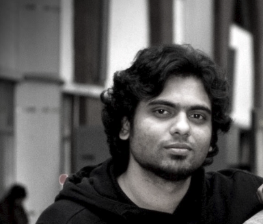

<h1 class="home-name">Shaikh Tanvir Hossain</h1>

  <strong>Doctoral Candidate</strong> 
  <strong>Faculty of Business and Economics</strong> 
  <a href="https://www.tu-dortmund.de/en/">Technical University of Dortmund</a> 

I am a final-year doctoral candidate in the Faculty of Business and Economics at [Technical University of Dortmund (TU Dortmund)](https://www.tu-dortmund.de/en/) under the supervision of [Professor Carsten Jentsch](https://lwus.statistik.tu-dortmund.de/en/chair/team/jentsch/). My dissertation, titled *Parametric and Nonparametric Learners for Adaptive Experiments*, has been submitted and is currently under review, with expected completion by mid-2026. Previously, I worked at the Department of Economics, [East West University, Bangladesh](https://www.ewubd.edu/) as a Lecturer (January – September 2025), where I taught undergraduate statistics courses for business and economics students. Before that, from 2018 to 2022, as a doctoral student I worked as a research associate (*Wissenschaftlicher Mitarbeiter*) in the Department of Statistics at TU Dortmund ([alumni page](https://lwus.statistik.tu-dortmund.de/en/chair/alumni/)), where I served as a teaching assistant and course instructor for graduate-level courses in econometrics, statistics, and data science. I gratefully acknowledge all their support and guidance during this period.

I obtained an M.Sc. in Economics from the [University of Mannheim, Germany](https://www.uni-mannheim.de/en/) and a Bachelor's degree in Business Administration with a second major in Economics from [BRAC University, Bangladesh](https://www.bracu.ac.bd/). After finishing my Bachelor's I worked as a project assistant at [Innovations for Poverty Action (IPA)](https://poverty-action.org/) in Bangladesh, on a project titled *Building management hierarchies for growth in LICs: understanding the role of supervisor training in the Bangladeshi garment sector*, led by [Professor Christopher Woodruff (Oxford)](https://www.qeh.ox.ac.uk/people/christopher-woodruff), [Professor Rocco Macchiavello (LSE)](https://www.lse.ac.uk/management/people/academic-staff/rocco-macchiavello), and [Professor Atonu Rabbani (Dhaka University)](https://www.du.ac.bd/faculty/faculty_details/ECO/401) as Principal Investigators.

My research interests lie at the intersection of Causal Inference, Econometrics, and Machine Learning. In my dissertation, I focus on adaptive experiments (a.k.a. bandit algorithms), from both theoretical and applied perspectives.

I am passionate about teaching statistics, econometrics, and programming. I love coding and theories related to different topics, and I want my students to love them too — but that doesn't always happen. You can find my CV [here](cv/Tanvir_cv.pdf) and some of my past teaching materials [here](teaching.qmd).

