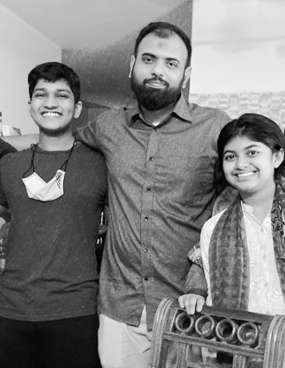

<!-- مَا شَاءَ اللَّهُ لَا قُوَّةَ إِلَّا بِاللَّهِ -->

Shaikh Tanvir Hossain

Doctoral Candidate TU Dortmund

<ul class="index-nav">
  <li><a href="index.html" class="active">Home</a></li>
  <li><a href="research.html">Research</a></li>
  <li><a href="teaching.html">Teaching</a></li>
  <li><a href="cv.html">CV</a></li>
  <li><a href="https://github.com/STHossain" target="_blank"><svg class="nav-icon" viewBox="0 0 16 16" fill="currentColor"><path d="M8 0C3.58 0 0 3.58 0 8c0 3.54 2.29 6.53 5.47 7.59.4.07.55-.17.55-.38 0-.19-.01-.82-.01-1.49-2.01.37-2.53-.49-2.69-.94-.09-.23-.48-.94-.82-1.13-.28-.15-.68-.52-.01-.53.63-.01 1.08.58 1.23.82.72 1.21 1.87.87 2.33.66.07-.52.28-.87.51-1.07-1.78-.2-3.64-.89-3.64-3.95 0-.87.31-1.59.82-2.15-.08-.2-.36-1.02.08-2.12 0 0 .67-.21 2.2.82a7.64 7.64 0 0 1 2-.27c.68 0 1.36.09 2 .27 1.53-1.04 2.2-.82 2.2-.82.44 1.1.16 1.92.08 2.12.51.56.82 1.27.82 2.15 0 3.07-1.87 3.75-3.65 3.95.29.25.54.73.54 1.48 0 1.07-.01 1.93-.01 2.2 0 .21.15.46.55.38A8.01 8.01 0 0 0 16 8c0-4.42-3.58-8-8-8z"/></svg> GitHub</a></li>
  <li></li>
</ul>

I am a final-year doctoral candidate in the Faculty of Business and Economics at [Technical University of Dortmund (TU Dortmund)](https://www.tu-dortmund.de/en/) under the supervision of [Professor Carsten Jentsch](https://lwus.statistik.tu-dortmund.de/en/chair/team/jentsch/). My dissertation, titled *Parametric and Nonparametric Learners for Adaptive Experiments*, has been submitted and is currently under review, with expected completion by mid-2026. Previously, I worked at the Department of Economics, [East West University, Bangladesh](https://www.ewubd.edu/) as a Lecturer (January – September 2025), where I taught undergraduate statistics courses for business and economics students. Before that, from 2018 to 2022, as a doctoral student I also worked as a research associate (*Wissenschaftlicher Mitarbeiter*) in the Department of Statistics at TU Dortmund ([alumni page](https://lwus.statistik.tu-dortmund.de/en/chair/alumni/)), where I served as a teaching assistant and course instructor for graduate-level courses in econometrics, statistics, and data science. I gratefully acknowledge all their support and guidance during this period.

I obtained an M.Sc. in Economics from the [University of Mannheim, Germany](https://www.uni-mannheim.de/en/) and a Bachelor's degree in Business Administration with a second major in Economics from [BRAC University, Bangladesh](https://www.bracu.ac.bd/). After finishing my Bachelor's I worked as a project assistant at [Innovations for Poverty Action (IPA)](https://poverty-action.org/) in Bangladesh, on a project titled *Building management hierarchies for growth in LICs: understanding the role of supervisor training in the Bangladeshi garment sector*.

My research interests lie at the intersection of Causal Inference, Econometrics, and Machine Learning. In my dissertation, I focus on adaptive experiments (a.k.a. bandit algorithms), from both theoretical and applied perspectives.

I am passionate about teaching statistics, econometrics, and programming. I love coding and theories related to different topics, and I want my students to love them too — but that doesn't always happen. You can find my CV [here](cv/Tanvir_cv.pdf) and some of my past teaching materials [here](teaching.html).

