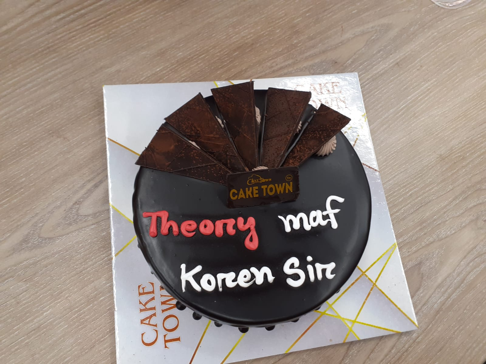

Shaikh Tanvir Hossain

Doctoral Candidate TU Dortmund

<ul class="index-nav">
  <li><a href="index.html">Home</a></li>
  <li><a href="research.html">Research</a></li>
  <li><a href="teaching.html" class="active">Teaching</a></li>
  <li><a href="cv.html">CV</a></li>
  <li><a href="https://github.com/STHossain" target="_blank"><svg class="nav-icon" viewBox="0 0 16 16" fill="currentColor"><path d="M8 0C3.58 0 0 3.58 0 8c0 3.54 2.29 6.53 5.47 7.59.4.07.55-.17.55-.38 0-.19-.01-.82-.01-1.49-2.01.37-2.53-.49-2.69-.94-.09-.23-.48-.94-.82-1.13-.28-.15-.68-.52-.01-.53.63-.01 1.08.58 1.23.82.72 1.21 1.87.87 2.33.66.07-.52.28-.87.51-1.07-1.78-.2-3.64-.89-3.64-3.95 0-.87.31-1.59.82-2.15-.08-.2-.36-1.02.08-2.12 0 0 .67-.21 2.2.82a7.64 7.64 0 0 1 2-.27c.68 0 1.36.09 2 .27 1.53-1.04 2.2-.82 2.2-.82.44 1.1.16 1.92.08 2.12.51.56.82 1.27.82 2.15 0 3.07-1.87 3.75-3.65 3.95.29.25.54.73.54 1.48 0 1.07-.01 1.93-.01 2.2 0 .21.15.46.55.38A8.01 8.01 0 0 0 16 8c0-4.42-3.58-8-8-8z"/></svg> GitHub</a></li>
  <li></li>
</ul>

I love teaching — over the years I have learned a great deal from my students, both in Germany and in Bangladesh. Below I share some of the materials I have prepared for my courses.

Students made a cake for me on the last day of MAT 211. The cake says <em>Theory maf kroen sir</em> — <em>"Sir, forgive us from the theory!"</em>

<h3>East West University</h3>
Dhaka, Bangladesh

| Course | Role | Term(s) | Links |
|--------|------|---------|-------|
| ECO 204: Statistics for Business and Economics II | Instructor | Summer 2022, Fall 2022, Fall 2023, Spring 2025, Summer 2025 | [Summer 2025](https://ewu-econ.github.io/eco204) \| [Fall 2023](eco204.qmd) |
| ECO 104: Statistics for Business and Economics I | Instructor | Fall 2022, Fall 2023, Spring 2025, Summer 2025 | [Summer 2025](https://ewu-econ.github.io/eco104) \| [Fall 2023](eco104.qmd) |
| MAT 211: Mathematics for Business and Economics II | Instructor | Fall 2024 | |
| MAT 100: College Mathematics | Instructor | Summer 2022, Fall 2024 | |

<h3>TU Dortmund</h3>
Dortmund, Germany

* Past course offerings can be verified via the <a href="https://lwus.statistik.tu-dortmund.de/en/teaching/courses/" target="_blank">TU Dortmund department archives</a> (listed under the name <strong>S. Hossain</strong>).

| Course | Role | Term(s) | Links |
|--------|------|---------|-------|
| Programming with Julia | Instructor | Winter Semester 2019/20 (Cancelled due to Covid-19), Winter Semester 2020/21 | [Materials](julia_course.qmd) |
| Pre-course Statistics, Statistical Estimation | Instructor | | |
| Asymptotic Theory (Part of Statistics Theory Course) | Teaching Assistant | Winter Semester 2019/20, Winter Semester 2020/21 | |
| Econometrics of Treatment Effects and Policy Evaluation | Teaching Assistant | Summer Semester 2020 | |
| Seminar on Treatment Effect Models | Teaching Assistant | Winter Semester 2018/19 | |

<h3>University of Mannheim</h3>
Mannheim, Germany

| Course | Role | Term(s) | Links |
|--------|------|---------|-------|
| Impact Evaluation and Research Design | Teaching Assistant | Winter Semester 2017/18 | |

